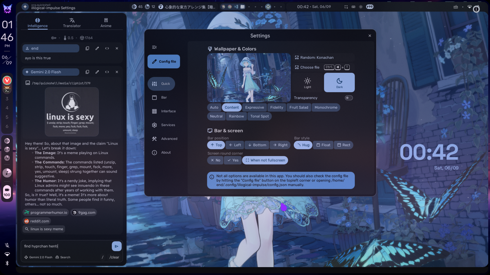

    <h1>【 Refactored end_4's Hyprland dotfiles 】</h1>
    <h3>Personal Setup using end-4's Dotfiles</h3>

 

    <h2>• overview •</h2>
    <h3></h3>

 
 
  
Notable features

     
  - **Overview**: Shows open apps with live previews. Type to search/calculate/run
  - **AI**: Gemini API and Ollama models
  - **Autogenerated colors**: Accessible and beautiful Material colors based on wallpaper
  - **Transparent installation**: Every command is shown before it's run

 
  
Installation (illogical-impulse Quickshell)

   - See the [Wiki](https://end-4.github.io/dots-hyprland-wiki/en/ii-qs/01setup/) (both install script and manual installation available)
   - **Default keybinds**: Should be somewhat familiar to Windows or GNOME users. Important ones:
     - `Super`+`/` = keybind list
     - `Super`+`Enter` = terminal
     - If for whatever reason the keybind list widget does not work, here's an image:
     

  
Software overview

  | Software | Purpose |
  | ------------- | ------------- |
  | [Hyprland](https://github.com/hyprwm/hyprland) | The compositor (manages and renders windows) |
  | [Quickshell](https://quickshell.outfoxxed.me/) | A QtQuick-based widget system, used for the status bar, sidebars, etc. |

  - THERE IS NO WAYBAR
  - For the full list of dependencies, see the [arch-packages folder](https://github.com/end-4/dots-hyprland/tree/main/arch-packages)

    
Discord

        <a href="https://discord.gg/GtdRBXgMwq"> Server link </a> | I hope this provides a friendlier environment for support without needing me to personally accept every friend request/DM. For real issues, prefer GitHub

    <h2>• screenshots •</h2>
    <h3></h3>

<table style="border-collapse: collapse;">
  <tr>
    <td width="25%">
      
    </td>
    <td width="75%">
      <i>latest and only style that I actively use. Other past styles are still there for your viewing pleasure and not actual use, but code is still available, see below.</i>
    </td>
  </tr>
</table>

### illogical-impulseQuickshell

Widget system: Quickshell | Support: Yes

[Showcase video](https://www.youtube.com/watch?v=RPwovTInagE)

    <h2>• inspirations/copying •</h2>
    <h3></h3>

 - Inspiration: osu!lazer, Windows 11, Material Design 3, AvdanOS (concept)
 - Copying: The license allows you to. Personally I have absolutely no problem with others redistributing/recreating my work. There's no "stealing" (unless you do weird stuff and violate the license). (this note is here because some people actually asked)
